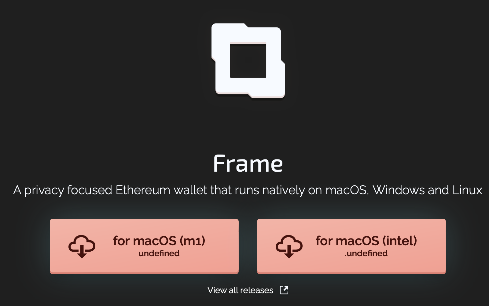

# 👋 Introduction
This open-source project provides [Lattice<sup>1</sup>](https://gridplus.io/lattice) owners a HTTP server which they manage themselves, and that will proxy all messages between the device over their own local network, as an alternative to relying on the vendor-provided routing service. 

By default, communication between apps and a Lattice<sup>1</sup> route through cloud infrastructure provided by [GridPlus](https://gridplus.io). Any messages sent to, and from, your device will always be encrypted and remain secure; however, we believe Lattice<sup>1</sup> owners should be able to manage this service themselves, if they so choose.

### 🔗 Related Links
 - [📢 Discord](https://twitter.com/gridplus)
 - [🐤 Twitter](https://discord.gg/Bt5fVDTJb9)
 - [📚 Knowledge Base](https://docs.gridplus.io)
&nbsp;

## 🤔 Why use Lattice Connect?

Running _Lattice Connect_ yourself provides several advantages:

 - Doesn't requires running an external MQTT broker (compared to `v1`);
 - Offers the fastest message routing possible for a Lattice<sup>1</sup>;
 - Provides the highest amount of privacy available while using a Lattice<sup>1</sup>;
 - Zero configuration changes required (i.e., no SSH'ing necessary);
 - Setup takes less than 5 minutes!

## 🚨 What about `v1`?
This project replaces the original _[lattice-connect](https://github.com/GridPlus/lattice-connect)_, which is now archived. 

At the time of release, the previous software should continue working as-is; however, GridPlus will no longer offer technical support, or otherwise provide maintenance for the prior version. Thus, breaking changes that may occur as we continue improving our customers' user experience should be expected, and switching to `v2` as soon as possible is highly recommended.

# ⌛️ Setup Guide

It's possible to run the server:

 - directly on a host system using `node` v14+; or,
 - through a `Docker` container.

> _**NOTE:** The instructions for each are nearly identical. This guide describes `node`;
scripts are provided in `connect/container` that support the `Docker` method._

### System Requirements

Besides the runtime requirements, the system resources for the proxy server are trivial. It will work on any system which can run Node v14+, or Docker.

The server has been tested on:

 - macOS v10.12;
 - Ubuntu 18.04;
 - Windows 10

##### Estimated Time (TOTAL): 5–10 minutes
##### Overview of steps are:

 1. Configuring, then running, `lattice-connect-v2`; and,
 2. Downloading, and installing, _[Frame](https://frame.sh)_; and,
 3. Setting your _Lattice Relayer_ host in _Frame_; and,
 4. Connecting your Lattice<sup>1</sup> to the _Frame_ app.

## ⚙️ Configuring

#### 1️⃣ Get the source code
Clone the repo to the server or computer you plan to run it on:

 ```sh
 # Clone the repo:
$ git clone https://github.com/GridPlus/lattice-connect-v2.git

# Change your working director to the 'connect' folder:
$ cd lattice-connect-v2/connect
```

#### 2️⃣ Configure the environment
Edit `connect/.direct.env` and set your device's hostname: 

```sh
# - Open the '.direct.env' file; then,
# - Replace this with your device's hostname 
ADMIN_CLIENT_HOST=http://GridPlus-xxxxxxxxxxx.local 
```
##### 🔍 Checking your device's hostname
On Firmware v16, and above, the device's hostname is shown with the following steps:

 1. **Unlock** the device; then,
 2. Tap **System Preferences**; then,
 3. Tap **Device Info**; then,
 4. See `SSH Host`.

## 🌐 Start Proxy: Using Node
From inside `connect` folder, run: 

```sh
# Install dependencies
$ npm i 

# Start the proxy
$ npm run start:direct

# Look for confirmation...
... [!] MQTT client connected
```


## 🐬 Start Proxy: Using Docker
From inside the `connect/container` folder, run:

```sh
# Script to build the container
$ ./dockerBuild.sh

# Script to start the proxy server
$ ./dockerStart.sh
```

## 🔬 Troubleshooting 

If the server fails to connect:

 - Double-check your `ADMIN_CLIENT_HOST` value;
 - Ensure `.local` is included as as suffix on the host;
 - `ping` your device; be certain your device is reachable outside this context;
 - instead of the Lattice<sup>1</sup> hostname, use its IP address
 
### Using IP Address
For many of the most common network setups, the server should have no trouble finding, and connecting, to the Lattice<sup>1</sup>. However, if it's unable to connect—and you're certain you've inputted the `<HOSTNAME>.local` correct—try setting the device's IP address instead of its hostname:

```sh
# - Open the '.direct.env' file; then,
# - Replace this with your device's IP address
# - don't include '.local'; it's standard IPv4 format.
ADMIN_CLIENT_HOST=http://<IP_ADDRESS>
```

The IP address of the device can be determined from your network's main router or gateway appliance. You may SSH into the device which you've confirmed can find/connect to the device via the hostname, and—after SSH'ing in—type `ifconfig` and review the IP address information for the WiFi adapter.

## 🖼 Frame Wallet



 Download [Frame](https://frame.sh) wallet desktop app, and run the installer.

#### Set the Lattice Relay

From the _Settings_ panel (upper-right; slider icon):

 - Scroll down to the **Lattice Relay** option; then,
 - Click _Default_; switch to _Custom_; then,
 - Input the `http://<RELAY_HOST>:8080`

Replace `RELAY_HOST` with the host running _Lattice Connect_.
When running _Frame_ and _Lattice Connect_ on the same computer, use `localhost`:


## FAQ

### What do I need to do migrate from `v1`?
Nothing. If you've made changes from `SSH`, they will be ignored by `v2`. 

If you're adament about having factory settings, you may reset your router in the Lattice<sup>1</sup> System Settings. Please be aware doing this will also reset your wireless routing settings, and will require reconnecting to your Wi-Fi network.

### Can I use _Lattice Connect_ with MetaMask?
If you're setting up _Lattice Connect_ for the first time, we highly recommend using Frame. MetaMask setup is possible, though more involved. Specific instructions will be added soon.

### How do I connect more than one Lattice<sup>1</sup>?
Currently, the direct method supports a single Lattice<sup>1</sup> at a time.
